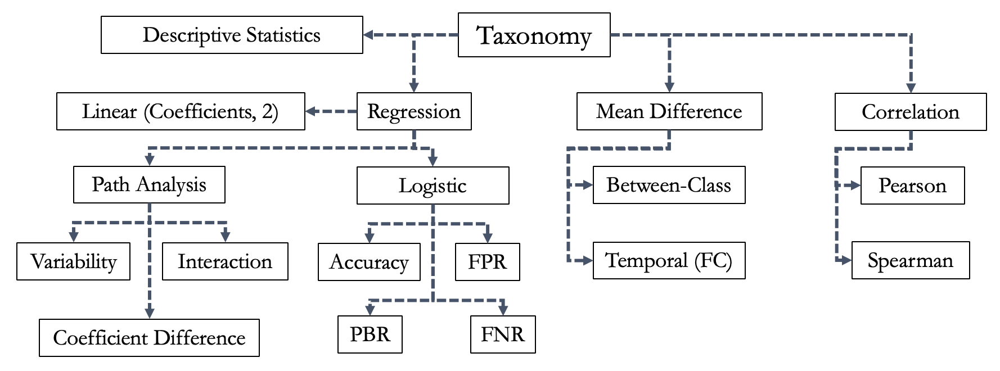

[](https://opensource.org/licenses/MIT) [](https://www.python.org/)

# SynRD Package
A Differentially Private (DP) Synthetic Data benchmarking package, posing the question: "Can a DP Synthesizer produce private (tabular) data that preserves scientific findings?" In other words, do DP Synthesizers satisfy *Epistemic Parity*?

Citation: `Rosenblatt, L., Holovenko, A., Rumezhak, T., Stadnik, A., Herman, B., Stoyanovich, J., & Howe, B. (2022). Epistemic Parity: Reproducibility as an Evaluation Metric for Differential Privacy. arXiv preprint arXiv:2208.12700.` (under review)

## Installing the benchmark
The benchmark is currently in `beta-0.1`. Still, you can install the development version by running the following commands:
1. Create your preferred package management environment with `python=3.7` (for example, `conda create -n "synrd" python=3.7`)
2. `git clone https://github.com/DataResponsibly/SynRD.git`
3. `cd SynRD`
4. `pip install git+https://github.com/ryan112358/private-pgm.git` 
5. `pip install .`

Step (4) installs a non-PyPi dependency (this excellent package for DP synthesizers here: (https://github.com/ryan112358/private-pgm)[https://github.com/ryan112358/private-pgm]).

*Note: This package is under heavy development - if functionality doesn't work/is missing, feel free to add an issue or submit a PR to fix!*

## Further dependency notes
If you would like to benchmark with the paper `Fruiht2018Naturally`, please follow some of the following `rpy2` installation instructions to configure your R-Python interface package.

### Install Option 1 for R

If you have a mac with an M1 chip, you may have success installing rpy2 via the following:
- Uninstall existing R versions on your machine.
- Install `R-4.2.2-arm64.pkg` from [https://cran.r-project.org/bin/macosx/](https://cran.r-project.org/bin/macosx/).
- `conda install -n base conda-forge::mamba`
- `mamba install -c conda-forge rpy2`

###  Install Option 2 for R

To run analysis for papers using R, you must ensure that R is downloaded and your R_HOME environment variable is set to the path of the R executable.

For installing with Anaconda, you may use `conda install r-base r-essentials`.

For confirming rpy2 is working as expected, try the following in Python:
```python
import rpy2

rpy2.robjects.r['pi']  # Returns R object with the number pi
```

## Notes on structure of package

- Each "paper" in the benchmark is named according to bibtex convention (authorYEARfirstword).

_________________

# Notes on benchmark construction, reasoning, etc.

## Taxonomy of findings



## How to add a new paper
Brief details on how to add a new paper.

1. Create a new folder with (authorYEARfirstword)
2. Create a `process.ipynb` notebook as your data playground. Use this to investigate data cleaning/processing/results generation.
3. In parellel with (2), create a `authorYEARfirstword.py` file, and extend the `Publication()` metaclass with `AuthorYEARFirstword(Publication)`. Add the relevant details (see `meta_classes.py` for notes on what this means). Then, begin to move over `findings` from `process.ipynb` into replicable lambdas in `AuthorYEARFirstword(Publication)`.
4. Ensure that `AuthorYEARFirstword(Publication)` has a `FINDINGS` list class attribute. This should consist of `Finding` objects that wrap each `finding_i(self)` lambda in the proper `Finding, VisualFinding or FigureFinding` metaclass, and adds it to the list. 
5. See `Saw2018Cross` for an example of a cleanly implemented `Publication` class.

### Addendum on finding lambdas
`Finding` lambdas should have a particular structure that should be strictly adhered to. Consider the following example, and note particularly the return values
```Python
def finding_i_j(self): # there can be kwargs
    """
    (Text from paper, usually 2 or 3 sentences)
    """
    # often can use a table finding directly or 
    # as a starting point to quickly recreate 
    # finding
    results = self.table() 

    # (pandas stuff happens here to generate 
    # the findings)

    return ([values], 
            soft_finding, 
            [hard_findings])
```
The finding lambdas can essentially perform any computation necessary, but must return a tuple of
1. A list of values (these are a set of any relevant values to the soft finding, non-exhaustive)

    #### For example:
    ```Python
    [interest_stem_ninth,interest_stem_eleventh]
    ```

2. A soft_finding boolean (this is simply a boolean that reflects the primary inequality/contrast presented in the original paper for this finding)
    #### For example:
    ```Python
    soft_finding = interest_stem_ninth > interest_stem_eleventh
    ```

3. A list of hard findings i.e. values (this could be the difference or set of differences that affected the soft_finding inequality. F)
    #### For example:
    ```Python
    hard_finding = interest_stem_ninth - interest_stem_eleventh
    hard_findings = [hard_finding] 
    ```