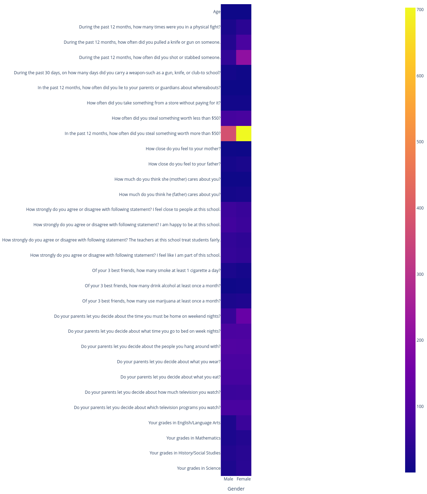
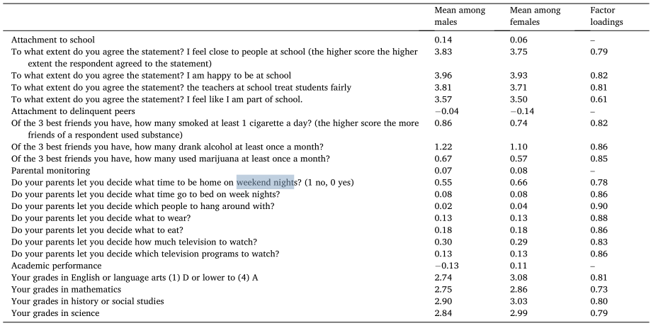

Unfortunately, the basic counts and averages, reported in the paper were impossible to achieve.

In the paper the authors do not specify the exact process of data cleaning which allowed high number of options.

Also, I found that some of the claimed relations of certain parameters between males and females seem to be wrong.

In particular, the paper claims that people steal things > 50$ 4 times more then < 50$, which seem to not be the case. My conclusion is that the authors mixed up columns which is very obvious comparing my values with the provided in the paper:

Eventually, it turned out to be impossible to match the averages reported in the paper. The differences are up to 200%. For example, authors claim that parents mostly let kids decide about the time they must be home on weekend nights, but even by taking a look at the data it's clear that it's not the case, unless the missing values in other fields correlate very strongly with this field, such that the disctribution of the values left is very different.

As all further research is based on aggregating the data in order to create more general columns like "attachment to parents" etc, and on top of that perform multivariate linear regression. Obviously the results would differ with the variables varying by 200%, hence the I decided to not proceed with the paper.
